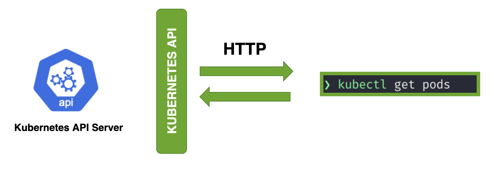

# Kubernetes - a Container Orchestrator or yet another API Server



# Introduction
Kubernetes is Container Orchestrator but if we look closer at its core, it's more of an API Server for your infrastructure. In Kubernetes, everything is treated as an API object. All the resources in a Kubernetes cluster, such as pods, services, deployments, and others are represented as API objects. These API objects are defined using the [Kubernetes API schema](https://kubernetes.io/docs/concepts/overview/kubernetes-api/) and are exposed via the [Kubernetes API server](https://kubernetes.io/docs/reference/command-line-tools-reference/kube-apiserver/).

# Kubernetes API Server
The [Kubernetes API server](https://kubernetes.io/docs/reference/command-line-tools-reference/kube-apiserver/) serves as the front-end for the Kubernetes control plane. It receives and processes API requests from clients, such as the [kubectl command-line tool](https://kubernetes.io/docs/reference/kubectl/) or other [Kubernetes components](https://kubernetes.io/docs/concepts/overview/components/), and translates them into operations on the underlying resources.

Clients interact with the Kubernetes API server using the [Kubernetes API](https://kubernetes.io/docs/concepts/overview/kubernetes-api/), which is a RESTful API that supports a variety of HTTP methods, such as GET, POST, PUT, PATCH and DELETE. The Kubernetes API provides a unified interface for managing Kubernetes resources across multiple clusters.

# Pre-requisites
To follow along this guide, you need below tools.
- Kubernetes Cluster: A running Kubenetes cluster ([CivoCloud](https://www.civo.com/) provides free credits worth $250 for 1 month)
- Kubectl: [Kubectl command line tool](https://kubernetes.io/docs/reference/kubectl/) to interact with Kubenretes cluster
- Curl: [Curl command line tool](https://curl.se/) to make HTTP request

# Verbs and Kind
The [Kubernetes APIs](https://kubernetes.io/docs/reference/kubernetes-api/) have two concepts in its specification: `Kubernetes API Verbs` and `Kubernetes Kinds`.
### Verbs
[Verbs](https://kubernetes.io/docs/reference/using-api/api-concepts/#api-verbs) are used to describe the operations that can be performed on Kubernetes resource. The standard verbs used are `get, create, update, patch, delete, list, watch, and deletecollection`. Each of these verbs have corresponding HTTP Verbs like GET, POST, PUT, PATCH, DELETE.

Example: To list all pods in specific namespace, you can use `get` verb with HTTP GET method.
```
GET /api/v1/namespaces/{namespace}/pods
```
### Kind
`Kind` defines the types of resources that can be created or managed in a Kubernetes cluster. Each Kubernetes resource has a specific kind that defines its properties and behavior.

The `kind` field in API objects is used alongwith the [API group](https://kubernetes.io/docs/reference/using-api/#api-groups) and [API version](https://kubernetes.io/docs/reference/using-api/#api-versioning). When requests are made to the Kubernetes API, data structures are exchanged through the bodies of requests and responses. These structures share common fields: `apiGroup`, `apiVersion` and `kind`, to help the participants of the request recognize these structures.

To list all the `apiGroup`, `apiVersion` and `kind`, use the `kubectl api-resources` command.
```
❯ kubectl api-resources
NAME             SHORTNAMES         APIVERSION    NAMESPACED   KIND
pods             po                 v1            true         Pod
deployments      deploy             apps/v1       true         Deployment
services         svc                v1            true         Service
...
output truncated for brevity
```
The kind `Deployment` has apiGroup as `apps` and apiVersion as `v1`. Also note that the APIVERSION column is made up of `apiGroup/apiVersion`. For few resources like pods and services its value shown is `v1` but its actually `core/v1`. The `core` apiGroup is usually not represented in path.

The apiVersion and kind are used in yaml manifest when you define Kubernetes resources. For example, to create deployment resource we need to specify appropriate values for apiVersion and kind as defined in the [reference page for deployment resource](https://kubernetes.io/docs/reference/kubernetes-api/workload-resources/deployment-v1/#Deployment).
```
apiVersion: apps/v1
kind: Deployment
```
[Refer this](https://kubernetes.io/docs/concepts/workloads/controllers/deployment/#creating-a-deployment) to check complete yaml.

# Kubernetes APIs
There are [various ways](https://kubernetes.io/docs/tasks/administer-cluster/access-cluster-api/) to access [Kubernetes APIs](https://kubernetes.io/docs/reference/kubernetes-api/) using HTTP REST APIs, Kubectl, [K8s client library](https://kubernetes.io/docs/reference/using-api/client-libraries/) and others. Use below command to check all the APIs that are exposed by Kubernetes API Server. In later section, we are going to explore few of these APIs.
```
❯ kubectl get --raw /
{
  "paths": [
    "/.well-known/openid-configuration",
    "/api",
    "/api/v1",
    "/apis",
    "/apis/",
    "/apis/admissionregistration.k8s.io",
    "/apis/admissionregistration.k8s.io/v1",
    "/apis/apiextensions.k8s.io",
    "/apis/apiextensions.k8s.io/v1",
    "/apis/apiregistration.k8s.io",
    "/apis/apiregistration.k8s.io/v1",
    "/apis/apps",
    "/apis/apps/v1",
...
output truncated for brevity
```

# Kubectl calls Kubernetes APIs
Under the hood, [Kubectl](https://kubernetes.io/docs/reference/kubectl/) calls Kubernetes APIs. You can examine which all API requests are made to Kubernetes API Server, when you execute Kubectl commands. To do so, make use of verbose flag `-v`, by settings its verbosity level to a value greater than or equal to 6.

For example, if you want to know which all requests are made to Kubernetes when listing pods, use following command.
```
❯ kubectl get pods --namespace default -v6
I0507 13:03:43.419318   10603 loader.go:373] Config loaded from file:  /Users/milindchawre/.kube/civo-demo-kubeconfig-new
I0507 13:03:43.854134   10603 round_trippers.go:553] GET https://74.220.16.34:6443/api/v1/namespaces/default/pods?limit=500 200 OK in 428 milliseconds
```
As you can see from the output, the API path used here is `/api/v1/namespaces/default/pods` which took `428 milliseconds` to respond with `200 OK` status code.

If you increase the verbosity level of `-v` flag even further, then you can also see things like request headers, response headers, response body, request timeline and others.

### Interact with Kubernetes API using HTTP REST API

Lets try to intract with Kubernetes APIs using HTTP REST API. To do so, lets first [setup HTTP proxy to access kubernetes api](https://kubernetes.io/docs/tasks/extend-kubernetes/http-proxy-access-api/) and then access the actual apis using Curl. The Kubernetes API server is typically secured using authentication and authorization mechanisms, and direct access to the API server may require setting up certificates, tokens, or other credentials. The `kubectl proxy` command sets up a proxy server between your local machine and the Kubernetes API server that allows you to authenticate and authorize your requests to the API server using your local Kubernetes configuration.
```
❯ kubectl proxy
Starting to serve on 127.0.0.1:8001

```
Open another terminal and try to access the `/version` API that prints version information of your Kubernetes cluster.
```
❯ HOST=http://127.0.0.1:8001

~
❯ curl $HOST/version
{
  "major": "1",
  "minor": "23",
  "gitVersion": "v1.23.6+k3s1",
  "gitCommit": "418c3fa858b69b12b9cefbcff0526f666a6236b9",
  "gitTreeState": "clean",
  "buildDate": "2022-04-28T22:16:18Z",
  "goVersion": "go1.17.5",
  "compiler": "gc",
  "platform": "linux/amd64"
}%

~
❯
```

### Health Check API Endpoints
There are few [special API endpoints](https://kubernetes.io/docs/reference/using-api/health-checks/) exposed by Kubernetes to provide an overview of your cluster status and health.
```
❯ curl "$HOST/livez?verbose"
[+]ping ok
[+]log ok
[+]etcd ok
[+]poststarthook/start-kube-apiserver-admission-initializer ok
[+]poststarthook/generic-apiserver-start-informers ok
...
output truncated for brevity
...
livez check passed

~
❯

~
❯ curl "$HOST/healthz?verbose"
[+]ping ok
[+]log ok
[+]etcd ok
[+]poststarthook/start-kube-apiserver-admission-initializer ok
[+]poststarthook/generic-apiserver-start-informers ok
...
output truncated for brevity
...
healthz check passed

~
❯
```

### List Kubernetes Resources
**_List Pods_**

List all the pods in default namespace.
```
❯ curl -X GET $HOST/api/v1/namespaces/default/pods
  "kind": "PodList",
  "apiVersion": "v1",
  "metadata": {
    "resourceVersion": "2990434"
  },
  "items": [
    {
      "metadata": {
        "name": "demo-6b6464447b-cvpwm",
        "generateName": "demo-6b6464447b-",
        "namespace": "default",
        "uid": "01063ff9-1552-45bd-be69-37d588268af4",
        "resourceVersion": "1093794",
        "creationTimestamp": "2023-04-11T09:09:20Z",
        "labels": {
          "app": "demo",
          "pod-template-hash": "6b6464447b"
        },
...
output truncated for brevity
```
This is equivalent to running the kubectl command: `kubectl get pods -n default`

**_List Deployments_**

List all deployments in project1 namespace.
```
❯ curl -X GET $HOST/apis/apps/v1/namespaces/project1/deployments
{
  "kind": "DeploymentList",
  "apiVersion": "apps/v1",
  "metadata": {
    "resourceVersion": "2990869"
  },
  "items": [
    {
      "metadata": {
        "name": "nginx",
        "namespace": "project1",
        "uid": "46bb89c8-86d5-4449-82f2-3c8ffb4dc954",
        "resourceVersion": "2625847",
        "generation": 3,
        "creationTimestamp": "2023-05-04T17:37:06Z",
        "annotations": {
          "deployment.kubernetes.io/revision": "3"
        },
...
output truncated for brevity
```
This is equivalent to running the kubectl command: `kubectl get deployments -n project1`

### Create Kubernetes Resources
Lets create a nginx pod directly using Kubernetes API, for that we first need to create a Kubernetes manifest.
```
❯ cat > pod.yaml <<EOF
apiVersion: v1
kind: Pod
metadata:
  name: nginx
spec:
  containers:
  - image: nginx
    name: nginx
EOF

❯
```
To create the resource, we make a POST call (note -X POST can be omitted as we use `--data-binary` flag).
```
❯ curl $HOST/api/v1/namespaces/project1/pods -H "Content-Type: application/yaml" --data-binary @pod.yaml
```
This is equivalent to running the kubectl command: `kubectl create --namespace project1 -f pod.yaml`

# Wrapping Up
In this blog, we gone through how Kubernetes at its core works as an API Server. We explored how Kubectl makes use of Kubernetes APIs. We also learn how to directly interact with these APIs using RESTful APIs.

For more information on Kubernetes API, I suggest you to go through [official documentation of Kubernetes](https://kubernetes.io/docs/home/). If you found this guide useful, let us know on twitter at [@civocloud](https://twitter.com/civocloud). You can also connect with me on the [Civo community Slack](https://civo-community.slack.com/), [Linkedin](https://www.linkedin.com/in/milind-chawre/) and [Twitter](https://twitter.com/milindchawre).