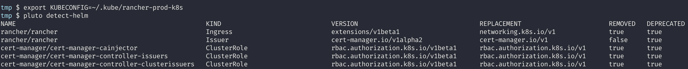

**A definitive guide for upgrading your kubernetes cluster**

### Introduction
If you are planning to upgrade your kubernetes cluster, then this is the guide for you. This guide is very generic irrespective of the way you have configured your cluster and it outlines things that one should consider before, during and after the upgrade.

### Why Upgrade
The kubernetes project maintains release branches for the most recent three minor releases (at the time of writing it's - 1.23, 1.22, 1.21). Kubernetes 1.19 and newer receive approximately 1 year of patch support. Kubernetes 1.18 and older received approximately 9 months of patch support. 

So as your kubernetes cluster version becomes old, there are more chances that your cluster will no longer get any updated release (even patch releases which are very crucial since they generally have security fixes). So it's always better to run latest and stable version which are in the list of [supported versions](https://kubernetes.io/releases/version-skew-policy/#supported-versions). For a quick check, you can also refer the list of [non-active releases](https://kubernetes.io/releases/patch-releases/#non-active-branch-history), if your cluster version is one of them then better to upgrade it.

### Before Upgrade
- Decide the version of kubernetes you want to upgrade to. Go through release notes of kubernetes upto that version. For example, if you are upgrading from v1.16.x to v1.23.x then check release notes of all the versions in-between.
- Checking release notes is very crucial so that you will know what all breaking changes were introduced in specific release and you can then accordingly take actions to ensure those breaking changes don't breaks your cluster after the upgrade.
- In release notes, check for deprecations, removal or breaking changes. [This is the best place](https://github.com/kubernetes/kubernetes/tree/master/CHANGELOG) to go through release notes.
- Kubernetes follows [semantic versioning](https://semver.org/) and are versioned as x.y.z -  (x: major, y: minor, z:patch). Ideally you should avoid skipping minor versions entirely during upgrade, as this can increase the chances of an issue due to accumulated changes. Suppose if you plan to upgrade from v1.16.x to v1.23.x then don’t directly jump to the target version v1.23.x. Perform upgrade in chunks v1.16.x -> v1.17.y -> v1.18.y -> … -> v1.23.x (much better if y is the most recent release in the series).

### During Upgrade
- Once you decide to upgrade, first start with taking backup of your cluster by taking etcd snapshot. Snapshotting is essential, if in case your cluster upgrade fails, you can fall back by restoring to this snapshot.
- Upgrade should be performed in rolling fashion, single node each time starting from control plane nodes then worker nodes (if etcd runs on separate nodes then upgrade those nodes first).
- Ideally during upgrade:
    - the node is first marked as un-schedulable (`kubectl cordon` or `kubectl drain`)
    - then the Kubernetes core components on that node are updated
    - at the end, the node is marked as schedulable (`kubectl uncordon`)

### Actual steps for upgrade
- The exact steps to upgrade your cluster might differ based on how and where you have configured your cluster. For example, in my case I used rancher to setup my cluster. So I followed [this guide](https://github.com/mattmattox/Kubernetes-Master-Class/tree/main/rancher-k8s-upgrades) to upgrade my cluster. Accordingly you guys need to follow the steps as per the tooling you used to configure your cluster.

### Post Upgrade
- Verify whether your upgrade is successful, check status of your kubernetes cluster (check health of kubernetes nodes and core system components [kube-apiserver, kube-scheduler, …]). Try to deploy sample application on the cluster and verify if the deployment is successful.
- Once you confirm your cluster upgrade is successful, take backup of your cluster by taking etcd snapshot.
- In case you use helm, then install appropriate version of helm supported by your newer version of kubernetes. To find appropriate version to install, check the [helm version support documentation](https://helm.sh/docs/topics/version_skew/).
- [Install appropriate version of kubectl](https://kubernetes.io/docs/tasks/tools/#kubectl) matching to the current version of your kubernetes cluster.

### Backout Plan
- Any mistakes during cluster upgrade might put your cluster in bad state, restoring the cluster to latest backup is the only solution to get out of it. Hence taking backup prior upgrade is very essential.

### Mistakes during upgrade
The most common mistake is missing to capture any breaking changes in the release notes of kubernetes. Doing so might result in your cluster not working as expected. The most common breaking changes are [kubernetes API deprecations or removals](https://kubernetes.io/docs/reference/using-api/deprecation-guide/).

### Kubernetes API deprecations or removals:
 Kubernetes periodically reorganizes or upgrades APIs as it evolves. The old APIs are deprecated and eventually removed. You can read more about how kubernetes deprecates their APIs in their [deprecation policy documentation](https://kubernetes.io/docs/reference/using-api/deprecation-policy/). So if you are using old APIs in your kubernetes deployment configuration then there are chances that it won’t work if those APIs are removed in the kubernetes version that you use. You can refer the [official documentation to check all the deprecated/removed APIs](https://kubernetes.io/docs/reference/using-api/deprecation-guide/). But the catch here is how to check which all deprecated APIs and which all resources in your kubernetes cluster use them. Listing your kubernetes resources using [kubectl commands](https://kubernetes.io/docs/reference/kubectl/cheatsheet/) might not give you correct version of API used as explained in [this issue](https://github.com/kubernetes/kubernetes/issues/58131#issuecomment-356823588). The solution for this is to use a tool named [Pluto](https://github.com/FairwindsOps/pluto).

### Pluto
[Pluto](https://github.com/FairwindsOps/pluto) is a tool developed by [FairwindsOps](https://www.fairwinds.com/) which helps in detecting [deprecated kubernetes APIs](https://kubernetes.io/docs/reference/using-api/deprecation-guide/) used in your code respositories and helm releases.
- **Features:**
    - It list all APIs that are deprecated or removed, not only for kubernetes but also for other tools like Istio, Cert Manager, etc.
    
    - Detects deprecated apis from your kubernetes configuration files.
    
    - Detect deprecated apis in helm charts installed on your cluster.
    

### Remediation for deprecated APIs
Let me take an example, in my case this is what got detected after running `pluto detect-helm`.

So as per the first line of the output, my cluster is running rancher helm chart which is using `Ingress` resource which is deprecated and also removed in some future kubernetes release. I can make use of `pluto list-versions` command to check exactly in which kubernetes version the API is deprecated and removed.

As shown above in the output, the `extensions/v1beta1` is deprecated in version `v1.14.0` and was removed in `v1.22.0`. So if my cluster is running on version >= `v1.22.0` then this helm chart will not work properly and I need to replace this deprecated api `extensions/v1beta1` with new api `networking.k8s.io/v1`, while replacing I'll also need to [accordingly make changes](https://kubernetes.io/docs/reference/using-api/deprecation-guide/#ingress-v122) in my deployment configuration. However this helm chart is not the one I developed, so I just need to check and upgrade this helm chart if any newer version is available. Generally latest helm charts use stable APIs which are not deprecated. You can run `helm search repo` command which list the latest available helm chart with it's version.

But if your cluster have lots of helm charts installed, then doing so for each and every chart is a tideous task. We have solution for this problem and it's another tool named [nova](https://github.com/FairwindsOps/nova) which is again developed by [FairwindsOps](https://www.fairwinds.com/). Nova scans your cluster for installed Helm charts, then cross-checks them against all known Helm repositories. If it finds an updated version of the chart you're using, or notices your current version is deprecated, it will let you know.

So using tools like Puto and Nova will help you in detecting and remediating deprecated kubernetes APIs.

### Conclusion
I hope this guide will help you in getting prepared for your cluster upgrade. If you found this guide useful, let us know on twitter at [@civocloud](https://www.twitter.com/civocloud). You can also connect with me on the [Civo community Slack](https://civo-community.slack.com/), [Linkedin](https://www.linkedin.com/in/milind-chawre) and [Twitter](https://twitter.com/milindchawre).
