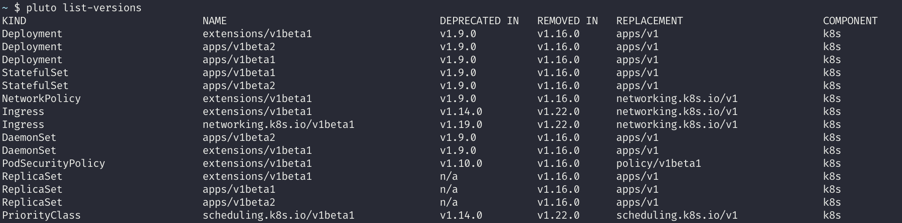
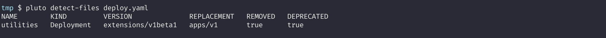
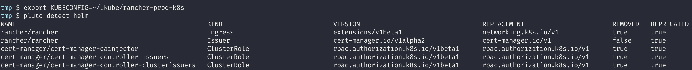
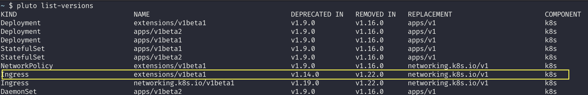
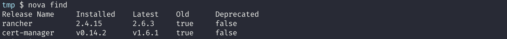

**Pluto: a tool to manage deprecated Kubernetes APIs**


### Introduction
This guide talks about a tool named Pluto. But before we dig deeper into the tool itself, lets first understand why this tool is required for that we should first understand what is deprecated Kubernetes APIs, why and when we should be concerned about it.


### Kubernetes APIs
The [Kubernetes API](https://kubernetes.io/docs/concepts/overview/kubernetes-api/) is a front end of Kubernetes control plane, using which user interacts with their cluster. Using these APIs, one can query and manipulate [kubernetes objects](https://kubernetes.io/docs/concepts/overview/working-with-objects/kubernetes-objects/) (for example: pods, namespaces, deployments, etc). You can access these Kubernetes APIs [using kubectl or directly through REST api or using client libraries](https://kubernetes.io/docs/tasks/administer-cluster/access-cluster-api/).


### Kubernetes API deprecations or removals
Kubernetes is an API-driven system, whose APIs keeps involving with every new release. The important part of any API driven system is having a good API deprecation policy, which informs users if an API is going to be removed or changed. Same is the case with Kubernetes, it periodically reorganizes or upgrades APIs as it evolves. The old APIs are deprecated and eventually removed. You can read more about how kubernetes deprecates their APIs in their [deprecation policy documentation](https://kubernetes.io/docs/reference/using-api/deprecation-policy/).


### Why I should be concerned about deprecated APIs
When you define application configuration, you specify the API version of kubernetes object that is used. May it be a simple kubernetes yaml manifest or helm chart, the `apiVersion` field identifies the API version of the Kubernetes object. This means that the user or the maintainer of the application should be aware when Kubernetes API versions have been deprecated and in what Kubernetes version they will be removed.

Also if you upgrade your kubernetes cluster then there are chances that you might encounter deprecated Kubernetes APIs, if the version you upgraded to don't supports it. If there are resources running on your cluster, which uses old API version, then its highly possibly that your application using that resource might not work.

A very good example would be APIVersion `extensions/v1beta1` of Ingress Resource, which was removed in v1.22 version of kubernetes. You would get error, when trying to use such removed api version in your configuration.
```
Error: UPGRADE FAILED: current release manifest contains removed kubernetes api(s)
for this kubernetes version and it is therefore unable to build the kubernetes
objects for performing the diff. error from kubernetes: unable to recognize "":
no matches for kind "Ingress" in version "extensions/v1beta1"
```

### Where and how I use kubernetes APIs
This is how you specify API version in your configuration.
```
# Sample configuration taken from: https://kubernetes.io/docs/concepts/workloads/controllers/deployment/#creating-a-deployment
---
apiVersion: apps/v1     <------ API Version of the kubernetes object
kind: Deployment
metadata:
  name: nginx-deployment
  labels:
    app: nginx
spec:
  replicas: 3
```
You can also check all supported API groups with its version by referring to [official documentation](https://kubernetes.io/docs/reference/generated/kubernetes-api/v1.23/#-strong-api-groups-strong-) or using kubectl command line.
```
$ kubectl api-versions
admissionregistration.k8s.io/v1
admissionregistration.k8s.io/v1beta1
apiextensions.k8s.io/v1
apiextensions.k8s.io/v1beta1
apiregistration.k8s.io/v1
apiregistration.k8s.io/v1beta1
apps/v1
            |
            |
```


### Challenges in detecting deprecated APIs in your cluster
There is official documentation from kubernetes to check [all the deprecated/removed APIs](https://kubernetes.io/docs/reference/using-api/deprecation-guide/). But the real catch here is how to check which all deprecated APIs and which all resources in your kubernetes cluster uses them. Listing your kubernetes resources using [kubectl commands](https://kubernetes.io/docs/reference/kubectl/cheatsheet/) might not give you correct version of API used, as explained in [this issue](https://github.com/kubernetes/kubernetes/issues/58131#issuecomment-356823588). The solution for this is to use a tool named [Pluto](https://github.com/FairwindsOps/pluto).


### Pluto
[Pluto](https://github.com/FairwindsOps/pluto) is a tool developed by [FairwindsOps](https://www.fairwinds.com/) which helps in detecting [deprecated kubernetes APIs](https://kubernetes.io/docs/reference/using-api/deprecation-guide/) used in your code respositories and helm releases.
- **Features:**
    - It list all APIs that are deprecated or removed, not only for kubernetes but also for other tools like Istio, Cert Manager, etc.
    
    - Detects deprecated APIs from your kubernetes configuration files.
    
    - Detects deprecated APIs in helm charts installed on your cluster.
    
    - It can also be used in your [github workflows](https://github.com/FairwindsOps/pluto#github-action-usage), to continuously keep check of deprecated APIs.


### Installation
You can install `Pluto` on your workstation, by downloading [appropriate release](https://github.com/FairwindsOps/pluto/releases).
```
$ wget https://github.com/FairwindsOps/pluto/releases/download/v5.4.0/pluto_5.4.0_linux_amd64.tar.gz
$ tar -zxvf pluto_5.4.0_linux_amd64.tar.gz
$ chmod +x pluto
$ cp pluto /bin/pluto
```


### Remediation for deprecated APIs
Let me take an example, in my case this is what got detected after running `pluto detect-helm`.

So as per the first line of the output, my cluster is running rancher helm chart which is using `Ingress` resource which is deprecated and also removed in some future kubernetes release. I can make use of `pluto list-versions` command to check exactly in which kubernetes version the API is deprecated and removed.

As shown above in the output, the `extensions/v1beta1` is deprecated in version `v1.14.0` and was removed in `v1.22.0`. So if my cluster is running on version >= `v1.22.0` then this helm chart will not work properly and I need to replace this deprecated api `extensions/v1beta1` with new replacement api `networking.k8s.io/v1`. While replacing, I'll also need to [accordingly make changes](https://kubernetes.io/docs/reference/using-api/deprecation-guide/#ingress-v122) in my deployment configuration. However this helm chart is not the one I developed, so I just need to check and upgrade this helm chart if any newer version is available. Generally latest helm charts use stable APIs which are not deprecated. You can run `helm search repo` command which list the latest available helm chart with it's version.

But if your cluster have lots of helm charts installed, then doing so for each and every chart is a tideous task. We have solution for this problem and it's another tool named [nova](https://github.com/FairwindsOps/nova) which is again developed by [FairwindsOps](https://www.fairwinds.com/). Nova scans your cluster for installed Helm charts, then cross-checks them against all known Helm repositories. If it finds an updated version of the chart you're using, or notices your current version is deprecated, it will let you know.

So using tools like Puto and Nova will help you in detecting and remediating deprecated kubernetes APIs.


### Conclusion
I hope this guide will help you in dealing with deprecated Kubernetes APIs. If you found this guide useful, let us know on twitter at [@civocloud](https://www.twitter.com/civocloud). You can also connect with me on the [Civo community Slack](https://civo-community.slack.com/), [Linkedin](https://www.linkedin.com/in/milind-chawre) and [Twitter](https://twitter.com/milindchawre).
